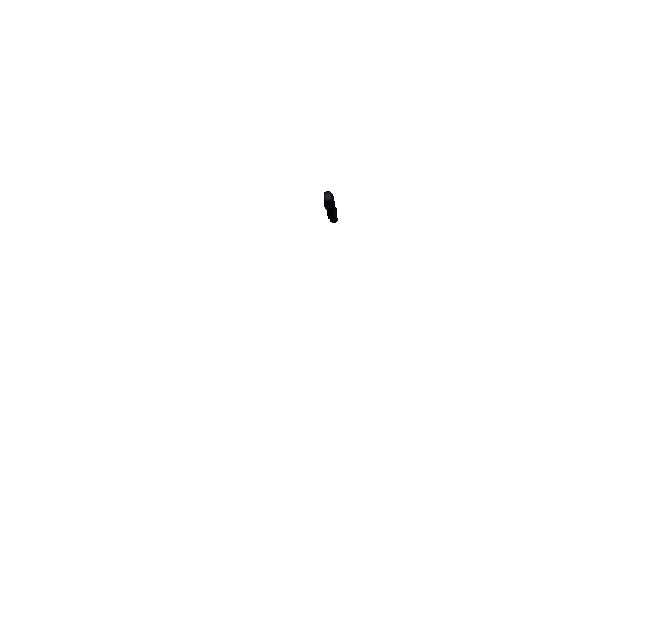

# UsagePet

**A tiny pixel pet that lives on your Mac and shows your Claude Code usage limits in real time.**



UsagePet floats on top of your screen as a little LCD gadget. The pet's mood follows your
5-hour session usage, the rim glows when your weekly limit gets tight, and when the week is
used up the pet simply goes on vacation until the reset.

> Unofficial side project. Not affiliated with, endorsed by, or supported by Anthropic.
> "Claude" and "Claude Code" are trademarks of Anthropic.

## Features

- **Current (5h) and Weekly** usage with percent, pixel bars and reset countdowns
- **Pet mood follows your 5h usage**: ecstatic, happy, chill, focused, worried, stressed, panic, and asleep once you're limited
- **Situational moods**: busy (Claude Code running), sleepy (late night), celebrate (5h reset), grateful (weekly reset), lonely (not linked), dizzy (offline), confused (API rate limit)
- **Weekly warnings on the rim**: yellow at 60%, orange at 80%, red at 95%, with a light running around the edge
- **Weekly battery** in the header (and in mini mode): cells drain as your weekly limit is used, blink when low, and show a bolt after the reset
- **Vacation scene** when your weekly limit hits 100%
- **Play with the pet**: hover to say hi, keep the pointer still for cuddles, jiggle to tickle, click to make it laugh, rub too much and it gets dizzy, swipe fast and it falls over
- Floating widget on every Space and over full-screen apps; never steals focus
- **Mini mode**, adjustable size (70–160%) and background opacity
- Classic theme if you prefer plain bars
- **Antigravity support**: reads quota from the running Antigravity app over 127.0.0.1. Pick Claude Code or Antigravity in Settings, or tap the title on the widget to switch — only one provider is ever shown (and polled) at a time
- Native Swift/SwiftUI, no third-party dependencies

## Requirements

- macOS 14 Sonoma or later
- Xcode 15+ command line tools (to build)
- [Claude Code](https://docs.claude.com/en/docs/claude-code) installed and logged in on a Pro or Max plan

## Install

```sh
git clone https://github.com/bqt1089/UsagePet.git
cd UsagePet
./scripts/build-app.sh --install
```

This builds a release app, signs it ad-hoc, copies it to `~/Applications/ClaudeUsageWidget.app`
(shown as **UsagePet**) and opens it. UsagePet runs from the menu bar (no Dock icon).

First run:

1. Click **Use Claude Code login** on the widget.
2. macOS asks to let UsagePet read the `Claude Code-credentials` Keychain item. Choose **Always Allow**.
3. Numbers appear within a few seconds.

Enable **Settings → General → Launch at Login** to start it automatically.

## Using it

- **Menu bar icon**: show/hide the widget, Mini Mode, Reset Widget Position, Refresh Now, Settings, Quit.
- **Widget**: drag to move, `–` to minimize, double-click to switch between full and mini, right-click for more.
- **Settings → Appearance**: theme (Pixel Pet or Classic), widget size (70–160%), background opacity.
- **Settings → Account**: link with your Claude Code login, sign in to Claude Code, paste a token, or unlink.
- **Settings → Providers**: pick Claude Code or Antigravity in Settings, or tap the title on the widget to switch. While Antigravity is active, choose which model group it shows (Auto/Gemini/Claude & GPT). The menu bar's Provider picker offers the same choice.

## How it works

UsagePet reuses the login you already have in Claude Code. It never asks for your password
and has no login screen of its own.

1. After you click **Use Claude Code login**, it reads the OAuth access token that Claude Code
   stores in your macOS Keychain.
2. About once a minute it sends one read-only request to the same usage endpoint that
   Claude Code's `/usage` command uses.
3. It shows the returned percentages and reset times. Countdowns tick locally.

## Privacy

- The token is only used for that request's `Authorization` header. It is never logged,
  written to disk, or sent anywhere other than `api.anthropic.com`.
- **Antigravity is local-only.** While selected as the active provider, UsagePet reads the running Antigravity app's own process arguments to find its local CSRF token (never printed or logged), and talks only to that app's own server on `127.0.0.1`. It never contacts Google or any other network host. Only the active provider is ever polled — switching to Claude Code stops all Antigravity requests, and switching to Antigravity stops all Claude Code requests and Keychain reads.
- No analytics, telemetry, or update checks. No other network traffic (enforced in CI).
- The "Claude Code running" mood only checks file modification times under
  `~/.claude/projects`; it never reads their contents.
- **Unlink** in Settings stops all requests.

## Security

- **Only build from this repository.** Forks can be modified to steal your token.
- If macOS asks for Keychain access when you haven't just rebuilt or updated UsagePet, click **Deny**.
- CI checks every change for unexpected network hosts and committed secrets.

See [SECURITY.md](SECURITY.md) for details and how to report a vulnerability.

## Caveats

- The usage endpoint is **undocumented**. It can change or disappear at any time, and the
  widget will then show its last known values until it's updated.
- Antigravity's local quota protocol is similarly **internal and undocumented** — it was reverse-engineered from the running app and may change or break without notice.
- Using Claude Code's token from another app may not be covered by Anthropic's terms.
  Review them and use this at your own risk.
- UsagePet does not refresh tokens. If Claude Code's token expires, open Claude Code once
  and the widget picks up the new one.
- If you log out of Claude Code, the widget clears its numbers and asks you to sign in again.
  It resumes on its own after you log back in.

## Development

```sh
swift test                       # core logic tests (also run on Linux)
swift run                        # run from source
./scripts/build-app.sh           # build build/ClaudeUsageWidget.app
```

`ClaudeUsageCore` holds the platform-independent logic (API client, parser, mood engine);
`ClaudeUsageWidget` is the SwiftUI/AppKit app. More detail in
[docs/DEVELOPMENT.md](docs/DEVELOPMENT.md).

Contributions welcome, especially new pet skins and moods.

## License

[MIT](LICENSE) © 2026 Toan Bui. The bundled Silkscreen font is under the SIL Open Font License.
