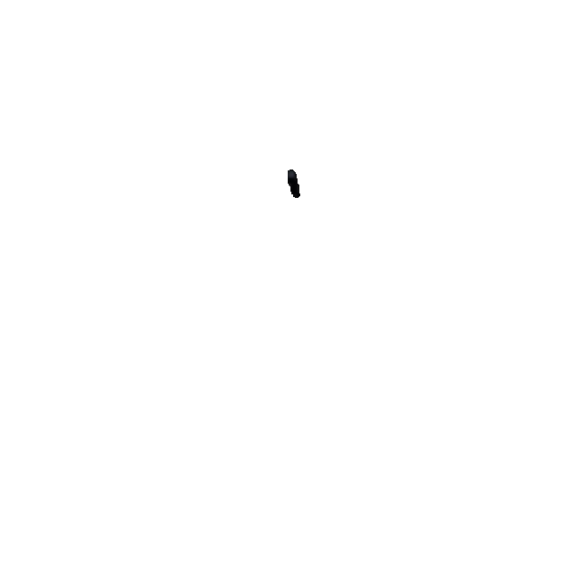

# UsagePet

**A tiny pixel pet that lives on your Mac and shows your Claude Code usage limits in real time.**



UsagePet floats on top of your screen as a little LCD gadget. The pet's mood follows your
5-hour session usage, the rim glows when your weekly limit gets tight, and when the week is
used up the pet simply goes on vacation until the reset.

> Unofficial side project. Not affiliated with, endorsed by, or supported by Anthropic.
> "Claude" and "Claude Code" are trademarks of Anthropic.

```sh
brew install --cask bqt1089/tap/usagepet
```

or download the app from [Releases](https://github.com/bqt1089/UsagePet/releases/latest).

## Features

### 📊 See your usage
- **Current (5h)** and **Weekly** limits as a percentage, with pixel bars and reset countdowns
- Updates about once a minute and right after your Mac wakes. **Refresh Now** fetches immediately
- The footer shows the status: *Refreshing…*, *Updated just now*, or *Refresh failed*

### 🐾 The pixel pet
- **Its mood follows your 5h usage**: ecstatic → happy → chill → focused → worried → stressed → panic, then asleep once you're limited
- **Situational moods**: busy (Claude Code is running), sleepy (late at night), celebrating (5h reset), grateful (weekly reset), lonely (not linked), dizzy (offline), confused (rate limited)
- **Vacation scene** once your weekly limit reaches 100%
- **Play with it**:
  - hover to say hi
  - hold still for cuddles
  - jiggle to tickle
  - click to make it laugh
  - rub too much and it gets dizzy
  - swipe fast and it falls over

### ⚠️ Weekly warnings
- **Glowing rim**: yellow at 60%, orange at 80%, red at 95%, with a light running around the edge
- **Weekly battery** in the header (and in mini mode): cells drain as you use your weekly limit, blink when low, and show a charging bolt after the reset

### 🖥️ Where it shows up
- **Floating widget**: stays on top on every Space and over full-screen apps, and never steals focus
- **Mini mode**: a small pill with just the 5h % and the battery
- **Menu bar numbers**: `42%` or `42% · 57%` next to the icon, which turns into ⚠️ near the limit
- **Menu-bar-only mode**: turn off the floating widget when you don't want it on screen
- Clicking the menu bar icon shows a quick summary: both limits and when they reset

### 🎨 Make it yours
- Two themes: **Pixel Pet** or **Classic** (plain bars)
- Widget size from 70% to 160%, and adjustable background opacity
- Launch at Login

### 🔑 Linking your account
- **Use Claude Code login**: reuses the sign-in Claude Code already has on this Mac
- **Sign in to Claude Code…**: runs `claude /login` in Terminal, links automatically, and closes the window when done
- **Advanced: paste token**: paste a token generated with `claude setup-token`, e.g. for a Mac where the Keychain route doesn't work
- **Unlink**: stops tracking and deletes everything UsagePet stored

### 🔒 Private by design
- Read-only: one request to the usage endpoint, never calls models
- Your token stays on your Mac, in the Keychain. No analytics, no telemetry
- Native Swift/SwiftUI, no third-party dependencies

## Requirements

- macOS 14 Sonoma or later (Apple Silicon or Intel)
- No Xcode needed for Homebrew or the download; building from source needs Swift 5.9+ (`xcode-select --install`)
- [Claude Code](https://docs.claude.com/en/docs/claude-code) installed and signed in with a Claude
  subscription (Pro or Max)

## Install

**Homebrew** (recommended):

```sh
brew install --cask bqt1089/tap/usagepet
```

Remove with `brew uninstall --cask usagepet` (see [Updating](#updating) for upgrades).

**Or download**: grab `UsagePet-<version>.zip` from [Releases](https://github.com/bqt1089/UsagePet/releases), unzip, and move `UsagePet.app` to Applications.

No Xcode needed either way. UsagePet runs from the menu bar (no Dock icon).

**First launch:** UsagePet isn't notarized yet, so macOS blocks it the first time. Open it once, then go to
**System Settings → Privacy & Security** and click **Open Anyway**. Only needed once per version.
Prefer Terminal? `xattr -dr com.apple.quarantine /Applications/UsagePet.app`

**Build from source** (needs Swift 5.9+, Xcode or Command Line Tools):

```sh
git clone https://github.com/bqt1089/UsagePet.git
cd UsagePet
./scripts/build-app.sh --install
```

First run: two ways to link an account.

- **Use Claude Code login**: already signed in to Claude Code on this Mac? Reuse that sign-in. If
  macOS asks for Keychain access, choose **Always Allow**. Numbers appear within a few seconds.
- **Sign in to Claude Code…** (recommended if you're not already signed in): opens Terminal and runs
  `claude /login`. Approve in your browser (no need to sign in again if you already are). UsagePet
  links and closes Terminal automatically — you never have to switch back to it.

Enable **Settings → General → Launch at Login** to start it automatically.

## Updating

UsagePet doesn't update itself yet — watch the repo's [Releases](https://github.com/bqt1089/UsagePet/releases) (**Watch → Custom → Releases**) to get notified.

| Installed with | Update |
|---|---|
| Homebrew | `brew update && brew upgrade --cask usagepet`, then open UsagePet again |
| Zip | Quit UsagePet (menu bar icon → **Quit**), download the new `UsagePet-<version>.zip`, unzip, and drag `UsagePet.app` over the old one (**Replace**) |
| Source | `cd UsagePet && git pull && ./scripts/build-app.sh --install` |

After updating (Homebrew or zip), macOS treats the new version as a new app because it isn't notarized yet:

- **Open Anyway** once in **System Settings → Privacy & Security** (or `xattr -dr com.apple.quarantine /Applications/UsagePet.app`).
- The Keychain prompt for Claude Code's login may appear again — choose **Always Allow**.

Builds from source skip **Open Anyway** (the Keychain prompt can still appear after a rebuild). Your linked account, theme, size, opacity and widget position are kept.

## Using it

- **Widget**:
  - drag to move
  - `–` to minimize
  - double-click to switch between full and mini
  - right-click for more
- **Menu bar icon**: Show/Hide Widget, Mini Mode, Reset Widget Position, Refresh Now, Settings, Quit
- **Settings → Account**: link or unlink (see [Linking your account](#-linking-your-account))
- **Settings → Appearance**:
  - theme, size, background opacity
  - Menu bar: *Icon only* / *5h %* / *5h + Weekly %*
  - Show floating widget
- **Settings → General**: Launch at Login

## How it works

UsagePet reads your usage through Claude Code's own login, and never asks for your password.

**Claude Code login**: reuses the login you already have in Claude Code.

1. After you click **Use Claude Code login**, it reads the OAuth access token that Claude Code
   stores in your macOS Keychain.
2. About once a minute it sends one read-only request to the same usage endpoint that
   Claude Code's `/usage` command uses.
3. It shows the returned percentages and reset times. Countdowns tick locally.

**Sign in to Claude Code…**: runs `claude /login` for you, then links automatically.

1. Clicking **Sign in to Claude Code…** opens Terminal and runs `claude /login` there, so it works
   even if you weren't signed in yet.
2. UsagePet watches Claude Code's own credentials (never the token itself, only a fingerprint of it)
   until they change, then links this app the same way **Use Claude Code login** does.
3. It closes the Terminal window for you — you never have to switch back to it.

## Privacy

- The Claude Code token is only used for that request's `Authorization` header. It is never
  logged, written to disk unencrypted, or sent anywhere other than `api.anthropic.com`.
- No analytics, telemetry, or update checks. No other network traffic (enforced in CI).
- The "Claude Code running" mood only checks file modification times under
  `~/.claude/projects`; it never reads their contents.
- **Unlink** in Settings stops all requests.

## Security

- **Only build from this repository.** Forks can be modified to steal your token.
- If macOS asks for Keychain access when you haven't just rebuilt or updated UsagePet, click **Deny**.
- CI checks every change for unexpected network hosts and committed secrets.

See [SECURITY.md](SECURITY.md) for details and how to report a vulnerability.

## Caveats

- The usage endpoint is **undocumented**. It can change or disappear at any time, and the
  widget will then show its last known values until it's updated.
- Using Claude Code's token from another app may not be covered by Anthropic's terms.
  Review them and use this at your own risk.
- UsagePet does not refresh tokens. If Claude Code's token expires, open Claude Code once
  and the widget picks up the new one.
- If you log out of Claude Code, the widget clears its numbers and asks you to sign in again.
  It resumes on its own after you log back in.

## Development

```sh
swift test                       # core logic tests (also run on Linux)
swift run                        # run from source
./scripts/build-app.sh           # build build/ClaudeUsageWidget.app
```

`ClaudeUsageCore` holds the platform-independent logic (API client, parser, mood engine);
`ClaudeUsageWidget` is the SwiftUI/AppKit app. More detail in
[docs/DEVELOPMENT.md](docs/DEVELOPMENT.md).

Contributions welcome, especially new pet skins and moods.

## License

[MIT](LICENSE) © 2026 Toan Bui. The bundled Silkscreen font is under the SIL Open Font License.
